# Website Scraper Project

A beginner-friendly **website summarizer** that fetches a webpage, extracts its readable text, and uses a locally running **Llama 3.2** model through **Ollama** to generate a short, snarky summary directly in the terminal.

This project is a refactored, standalone version of the Week 1 Day 1 notebook. It demonstrates how exploratory notebook logic can be organized into a small, maintainable Python application.

## Overview

The application accepts a URL from the user, downloads the page with `requests`, parses and cleans the HTML with `BeautifulSoup`, and sends the extracted text to a local LLM through Ollama's OpenAI-compatible API.

The project provides practical experience with:

- Fetching and parsing HTML content.
- Removing irrelevant page elements such as scripts, styles, images, and form inputs.
- Cleaning scraped text before sending it to an LLM.
- Building system and user messages for a language model.
- Calling a locally hosted model through an OpenAI-compatible client.
- Connecting a Python command-line application to an LLM from end to end.

## How It Works

The processing pipeline is:

```mermaid
flowchart LR
    A[User enters a URL] --> B[requests fetches HTML]
    B --> C[BeautifulSoup parses the page]
    C --> D[Irrelevant HTML is removed]
    D --> E[Readable text is extracted]
    E --> F[System and user prompts are built]
    F --> G[Ollama OpenAI-compatible API]
    G --> H[Llama 3.2 generates a summary]
    H --> I[Summary is printed in the terminal]
```



In simplified form:

```text
User URL
   ↓
requests                     Fetch raw HTML
   ↓
BeautifulSoup                Parse and clean HTML
   ↓
Extracted website text
   ↓
System and user prompts
   ↓
Ollama OpenAI-compatible API
   ↓
Llama 3.2
   ↓
Snarky summary printed to the terminal
```

## Project Structure

```text
Website Scraper Project/
├── main.py       # Prompts, LLM calls, summarization, and CLI entry point
├── scraper.py    # Website fetching and text extraction
├── README.md     # Project documentation
└── .gitignore    # Python-specific ignore rules
```

### Shared Week 1 Environment

This project intentionally reuses the shared Week 1 environment. The project folder does **not** contain its own `pyproject.toml`, `uv.lock`, or `.venv` directory. Those files are located one level above the project and are shared by the other Week 1 projects.

```text
week1/
├── pyproject.toml
├── uv.lock
├── .venv/
└── Website Scraper Project/
    ├── main.py
    ├── scraper.py
    ├── README.md
    └── .gitignore
```

Using the shared environment avoids duplicated dependency declarations and helps prevent version drift between projects in the same week.

## Requirements

| Requirement | Purpose |
|---|---|
| Python 3.12.x | Runs the application and its dependencies |
| [uv](https://docs.astral.sh/uv/) | Manages the shared Python environment |
| [Ollama](https://ollama.com/) | Runs the local LLM service |
| `llama3.2` | Generates the website summaries |
| `requests` | Downloads webpage HTML |
| `beautifulsoup4` | Parses and cleans HTML |
| `openai` | Connects to Ollama through its OpenAI-compatible API |

The required Python packages should already be declared in the shared Week 1 `pyproject.toml`.

> **Important:** Do not create a second virtual environment, `pyproject.toml`, or `uv.lock` inside this project folder. The project is designed to use the shared Week 1 environment.

## Setup

### 1. Synchronize the Shared Environment

From the root of the `llm_engineering` repository—the directory containing `pyproject.toml`—run:

```bash
uv sync
```

### 2. Start Ollama

Install [Ollama](https://ollama.com/) if it is not already installed. Start the Ollama application, or start the service from a terminal with:

```bash
ollama serve
```

Keep Ollama running while using the scraper.

### 3. Download and Verify Llama 3.2

Make sure the model is available locally:

```bash
ollama run llama3.2
```

The first run downloads the model if necessary and opens an interactive session. After confirming that the model works, exit the session with `Ctrl+C` or the appropriate exit command for your terminal.

## Running the Project

Navigate to the project directory and run the script using the shared environment:

```bash
cd "week1/Website Scraper Project"
python main.py
```

If you prefer to invoke the interpreter through `uv`, use:

```bash
uv run python main.py
```

The program will prompt you for a URL:

```text
Enter a URL to summarize:
```

For example:

```text
https://huggingface.co
```

The script will then fetch the website and generate a summary.

## Example Session

```text
Enter a URL to summarize:
https://example.com

Fetching and summarizing...

<LLM-generated summary>
```

The exact summary varies from run to run because it is generated live by Llama 3.2.

## Local Ollama Configuration

The application connects to Ollama using an OpenAI-compatible client with the following configuration:

```python
OpenAI(
    base_url="http://localhost:11434/v1",
    api_key="ollama",
)
```

The model used by the application is:

```python
MODEL = "llama3.2"
```

No OpenAI API key or `.env` file is required because the project uses Ollama locally.

## Limitations

This project is intentionally simple and is designed for learning rather than production-grade crawling.

| Limitation | Explanation |
|---|---|
| JavaScript-rendered pages | Websites that load most of their content through JavaScript may return little or no useful text because only the initial HTML response is fetched. |
| Anti-bot protection | Some websites may block automated requests and return errors such as `403 Forbidden`. |
| Text length | The scraper extracts a maximum of approximately 2,000 characters per page. |
| No browser rendering | The program is not a full browser and does not execute JavaScript, interact with forms, or render client-side applications. |
| Network availability | The target website and the local Ollama service must both be reachable. |

For dynamic websites, a browser automation framework such as Selenium or Playwright may be more appropriate than the simple `requests` and `BeautifulSoup` approach used here.

## Learning Objectives

After working through this project, you should have reinforced the following concepts:

- Web scraping fundamentals with `requests` and `BeautifulSoup`.
- Basic HTML parsing and content cleanup.
- Prompt construction using system and user messages.
- Communication with OpenAI-compatible APIs.
- Running and calling local LLMs through Ollama.
- Building a complete Python application that connects web data to an LLM.
- Refactoring notebook experiments into reusable application code.

## Changes and Design Decisions

### Preserved from the Original Notebook

The following parts of the notebook were intentionally kept:

- The `SYSTEM_PROMPT` and `USER_PROMPT_PREFIX` text.
- The Ollama connection approach using `OpenAI(base_url="http://localhost:11434/v1", api_key="ollama")`.
- The `MODEL = "llama3.2"` configuration.
- The message structure returned by `messages_for()`.
- The overall workflow: fetch the website, build messages, call the model, and display the result.

### Refactored for a Standalone Script

Notebook-only experiments were not copied into the final application. This includes exploratory calls, commented-out paid OpenAI API examples, the standalone `Hello, Llama!` test call, and the CNN/Anthropic demonstration calls. These were teaching or experimentation cells rather than part of the final program.

The `summarize()` and `display_summary()` functions accept a `client` parameter instead of relying on a global `ollama` variable. The client is created once in `main()` and passed to the functions, which makes the code easier to test and avoids hidden global state.

The terminal version uses `print()` instead of Jupyter's `IPython.display.Markdown`, since the application is designed to run as a normal Python script.

The names `system_prompt` and `user_prompt_prefix` were changed to `SYSTEM_PROMPT` and `USER_PROMPT_PREFIX` to follow the conventional Python naming style for module-level constants.

### Improvements in `scraper.py`

The scraper includes the following improvements:

- A `timeout=10` value is supplied to both `requests.get()` calls so that the program does not wait indefinitely for an unresponsive server.
- `response.raise_for_status()` is used so HTTP errors such as `403` and `404` produce clear exceptions instead of being silently parsed as webpage content.
- `headers` was renamed to `HEADERS`.
- The maximum extracted content length was moved into the named constant `MAX_CONTENT_LENGTH = 2_000` instead of being left as a magic number.
- `fetch_website_links()` was retained because it exists in the original scraper and may be useful for future extensions, even though `main.py` does not currently call it.

### Why the Project Does Not Have Its Own Dependency Files

The shared Week 1 `pyproject.toml` and `uv.lock` already define the dependencies required by this project, including `requests`, `beautifulsoup4`, and `openai`. Duplicating these files inside the project directory would fragment dependency management and could cause different Week 1 projects to use conflicting versions.

### Assumptions

This project assumes that:

- The shared Week 1 `pyproject.toml` includes `requests`, `beautifulsoup4`, and `openai`.
- The application is run through the shared `.venv` or `uv` environment rather than an unrelated system Python installation.
- Ollama is installed, running locally, and serving the `llama3.2` model.
- No `.env` file or OpenAI API key is required because the application uses Ollama exclusively.

## Related `.gitignore`

The project should use Python-specific ignore rules similar to the following:

```gitignore
__pycache__/
*.pyc
*.pyo
*.pyd
.venv/
.env
.ipynb_checkpoints/
```

## Future Improvements

Potential extensions include adding command-line arguments for the URL, supporting multiple output formats, improving error messages, extracting metadata such as the page title, following selected links, adding retry logic, and using Selenium or Playwright for JavaScript-heavy websites.

## License

No license has been specified for this project. Add a license file if you intend to distribute or reuse the code publicly.

## References

[1]: https://docs.astral.sh/uv/ "uv Documentation"

[2]: https://ollama.com/ "Ollama Official Website"

[3]: https://github.com/psf/requests "Requests on GitHub"

[4]: https://www.crummy.com/software/BeautifulSoup/bs4/doc/ "Beautiful Soup Documentation"

[5]: https://github.com/openai/openai-python "OpenAI Python Library"
